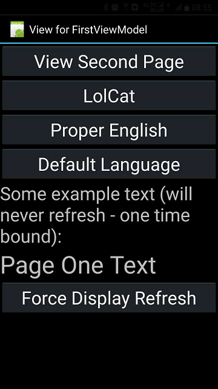
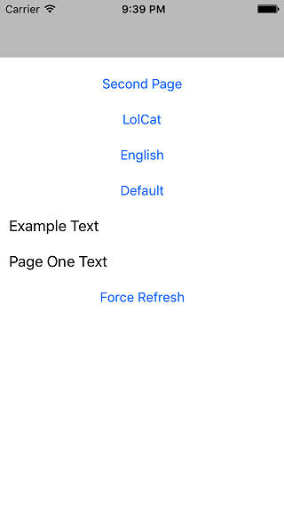

Babel
============

This tutorial demostrate the usage of [MvvmCross.Plugin.JsonLocalization](https://www.nuget.org/packages/MvvmCross.Plugin.JsonLocalization/) to load .json files in multiple languages.

WindowsUWP

Android

Wpf

iOS

